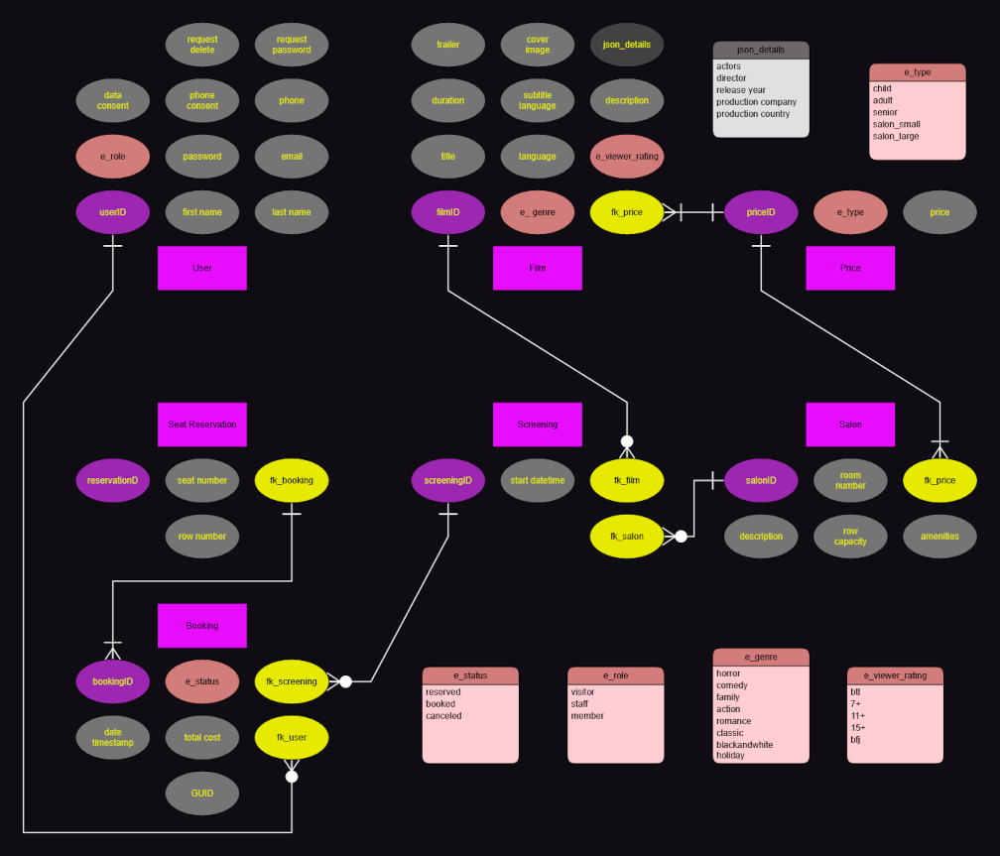

### Filmvisarna
A project for the fictive company Filmvisarna AB which is a samll, local cinema. The project frontend is written in TypeScript, the backend in C# featuring session based authentication and MySQL data storage.

The cinema offers showings four times a day in each of their two salons. The company's initial requests include displaying movie and screening information including screening dates, times and movie trailers. Site visitors can booking tickets online and recieve a confrimation which includes seat number and row, total cost and booking number.


## Technology stack
- Frontend
  - TypeScript
  - Node.js
  - React + Vite
- Backend
  - C# .Net
  - MySQL
  - Session-based authentication
  - MailKit library
- Tooling
  - Postman (testing)

## Requirements
### **System Requirements**

- Node.js v24.x
- Git
- Developed on MySQL server version 8.0.41 or higher
- Configured connection string

### **Functional Requirements**

Functional Requirements

- [x] wireframe - views/pages, headers, footers and menu system
- [x] mockup - shows layout, color schema, font, click-results including pages/views via Figma or similar (mobile, web, tablet)
- [x] Display seat configuration
- [ ] Update and display seat status for the user
- [x] Display film details - image, trailer, summary, actors, director etc.
- [ ] Choose desired seats during booking
- [x] Prevent double booking of seats
- [ ] Booking summary which includes - seat number, film title, date, time and unique booking number
- [ ] Booking summary sent to email
- [ ] Persistent booking data available to staff for booking confirmation at admission
- [x] Price variation for seniors, children and adults
- [x] Filter film showings by date
- [x] Filter films by viewer discretion rating
- [ ] Cancel a future booking
- [x] Self registration for new accounts
- [x] Login for registered accounts
- [x] Current bookings and booking history for registered accounts
- [x] Prototype with 5 films and at least 30 screenings for 2 salons
- [x] All views have their own unquie URL/route - to allow for sharing and bookmarking links
- [x] All information is in provided in Swedish, language and prices are formatted according to Swedish standards
- [ ] Website is responsive and well functioning
- [ ] Core functionality includes cookie usage tracking: login session cookie, favorite or sharing pages and consent by user
- [x] AI assistent that can provide information including - open hours, price, kiosk, how to book, salons size, film screenings and help with website navigation


## 🚀 How to Run

For inital setup
```shell
git clone git@github.com:hkmp1303/filmvisarna.git

cd filmvisarna

npm install
```
Once setup is complete
```shell
npm run dev
```

## Configuration
Configure the database connection string in `backend/db-config.json`. For initial setup use [backend/db-config.template.json](backend/db-config.template.json) which can be copied, renamed and filled in with the correct values.

## Database Design
### EER Diagram


### Database Setup
While in MySQLWorkbench, open the setup.sql, data.ddl and data.sql files from the project folder. Select "View all file types" to ensure the data.ddl file is visible. Run the SQL scripts in the order:
- [setup.sql](setup.sql)
- [backend/data.ddl](backend/data.ddl)
- [backend/data.sql](backend/data.sql)
- [backend/procedure.ddl](backend/procedure.ddl)

The setup.sql file creates the database and user while the tables are created by the data.ddl file. Finally, running the SQL queries in the data.sql file will populate the tables with mock data and the procedure.ddl creates the stored procedure(s). The data can also be populated using Postman. First reset the database with `delete /resetdb` while the API is running. Then restart the project using `npm run dev`. Note that only the table data will be repopulated.

## API Overview

The API will be available via HTTP protocal at `http://localhost:5001/api/*` after running the application. The correct port number will be displayed in the console output. Port configuration values are stored and can be changed in backend/Properties/launchSettings.json.

Frontend requests with paths that start with `http://localhost:5173/api/*` will be forwarded to the backend. 

### Key Endpoints

A Postman collection for this project can be found at this [link](https://heather-p-4407471.postman.co/workspace/heather-p's-Workspace~1044ea2e-896e-41da-83f4-6e11bd4ffb6c/collection/50645716-e710b040-056e-417b-8351-df3e268012e1?action=share&creator=50645716). You may need to request permission to view the collection. 


## Authentication

Authentication is session based. After successful login, the user ID is stored in the browser session and used for subsequent responses.

### Login Credentials

Below are mock user accounts which coorespond to booking and screening data. 

username|password|
|---|---|
aspoonfull@sugar.com|m3dicin3|
nromanoff@shield.gov|blackwid0w|
avikander@film.se | exmachina
nrapace@millennium.se | lisbeth
sskarsgard@cinema.se | chern0byl
mvonsydow@bergman.se | seventhseal

## Project Scope

This project is intended for educational purposes. Error handling and security are simplified. In a production environment, the connection string would be moved to configuration files or environment variables.

## Development Process

The project was developed using an Agile approach. Group members recieved user stories prioritized from a product owner's perspective by our instructor. Requirements were then defined as a backlog and implemented iteratively. Core function was prioritized while additional features were planned but not fully implemented within the project timeframe. Task tracking was managed using Projects via Github. The Kanban board can be accessed [here](https://github.com/users/hkmp1303/projects/5/views/1).

## Agile Artifacts

As part of the Agile development process, the project includes the following artifacts:
- Wireframe illustrating a simplified outline of the planned user interface
- Mockups illustrating the planned graphical user interface

These artifacts were developed in PetPot and are available in the [docs/agile](docs/agile) directory.

## Documentation

- [Architecture](docs/architecture.md) 
- [Technical Debt](docs/technical-debt.md)
- [Planned Work](docs/planned-work.md)

## Authors
This project was developed as a group asssignment.
- Heather
  - @hkmp1303
- Mikael
  - @M-Renberg
- Oscar
  - @OscarK99Swe
- Timoty
  - @pyr0xd

README & Documentation authored by: Heather
